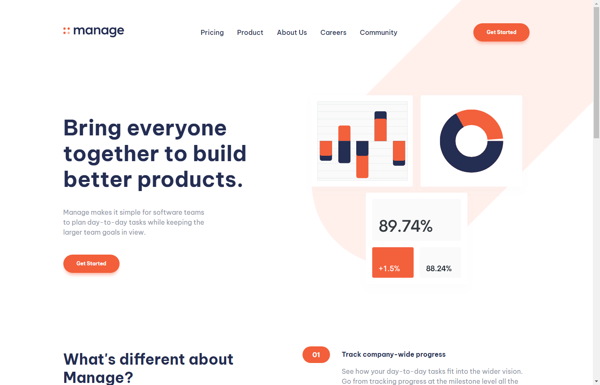

# Frontend Mentor - Manage landing page solution

This is a solution to the [Manage landing page challenge on Frontend Mentor](https://www.frontendmentor.io/challenges/manage-landing-page-SLXqC6P5). Frontend Mentor challenges help you improve your coding skills by building realistic projects.

## Table of contents

- [Frontend Mentor - Manage landing page solution](#frontend-mentor---manage-landing-page-solution)
  - [Table of contents](#table-of-contents)
  - [Overview](#overview)
    - [The challenge](#the-challenge)
    - [Screenshot](#screenshot)
    - [Links](#links)
  - [Built with](#built-with)
  - [Author](#author)

## Overview

### The challenge

Users should be able to:

- View the optimal layout for the site depending on their device's screen size
- See hover states for all interactive elements on the page
- See all testimonials in a horizontal slider
- Receive an error message when the newsletter sign up `form` is submitted if:
  - The `input` field is empty
  - The email address is not formatted correctly

### Screenshot

### Links

- Solution URL: [Solution](https://www.frontendmentor.io/solutions/manage-landing-page-s0kmY_u5XP)
- Live Site URL: [Website](https://mianazan099.github.io/manage-landing-page/css)

## Built with

- HTML
- CSS
- JS
- [Swiper](https://swiperjs.com/)

## Author

- Website - [Mian Azan](https://www.mianazan.com)
- Frontend Mentor - [@mianazan099](https://www.frontendmentor.io/profile/mianazan099)
